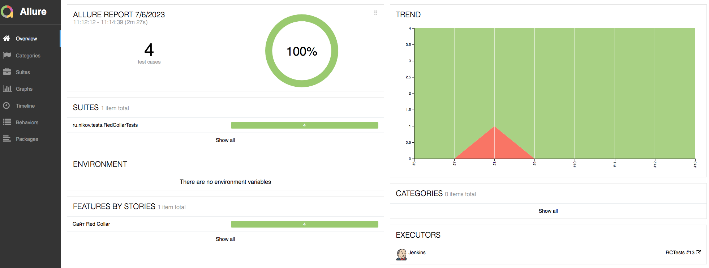

# Автоматизированное тестирование сайта Redcollar

## :pushpin:    Содержание

- [Описание](#open_book-описание)
- [Покрытый функционал](#globe_with_meridians-покрытый-функционал)
- [Использованный стек технологий](#computer-использованный-стек-технологий)
- [Запуск тестов](#man_technologist-Запуск-тестов)
- [Сборка в Jenkins](#-сборка-в-jenkins)
- [Пример Allure-отчета](#-пример-allure-отчета)
- [Интеграция с Allure TestOps](#-интеграция-с-allure-testops)
- [Интеграция с Jira](#интеграция-с-jira)
- [Уведомления в Telegram с использованием бота](#-уведомления-в-telegram-с-использованием-бота)
- [Примеры видео запуска тестов в Selenoid](#-примеры-видео-запуска-тестов-в-selenoid)

## :open_book: Описание
В проекте реализованы UI тесты для сайта [_wwww.redcollar.ru_](https://www.redcollar.ru/)
Автотесты написаны на <code>Java</code> с использованием <code>JUnit 5</code> и <code>Gradle</code>.
Для UI-тестов использован фреймворк [_Selenide_](https://selenide.org/).
Запуск тестов можно осуществлять локально или в [_Selenoid_](https://aerokube.com/selenoid/).
Также реализована сборка в <code>Jenkins</code> с формированием Allure-отчета и отправкой уведомления с результатами в <code>Telegram</code> после завершения прогона.


## <a name="globe_with_meridians-покрытый-функционал"></a>:globe_with_meridians: Покрытый функционал

- [x] Проверка актуальной контактной информации на сайте
- [x] Проверка перехода на страницу проектов из меню сайта
- [x] Проверка доступности вакансий на сайте
- [x] Проверка формы отклика на вакансию

## :computer: Использованный стек технологий

<p align="center">


</p>


## :man_technologist: Запуск тестов

### Локальный запуск тестов

```
gradle clean test -Denv=local
```
При необходимости можно переопределить параметры запуска

```
gradle clean test
-Denv=local
-Dbrowser=${BROWSER_NAME}
-DbrowserVersion=${BROWSER_VERSION}
-DbrowserSize=${BROWSER_SIZE}
-DbaseUrl=${BASE_URL}
```

### Запуск тестов на удаленном браузере

```
gradle clean test -Denv=remote
```
При необходимости также можно переопределить параметры запуска
```
gradle clean test -Denv=remote
-Dbrowser=${BROWSER_NAME}
-DbrowserVersion=${BROWSER_VERSION}
-DbrowserSize=${BROWSER_SIZE}
-DbaseUrl=${BASE_URL}
-DremoteUrl=${REMOTE_BROWSER_URL}
```
### Параметры сборки

> <code>BROWSER</code> – браузер, в котором будут выполняться тесты (_по умолчанию - <code>chrome</code>_).
>
> <code>BROWSER_SIZE</code> – размер окна браузера (_по умолчанию - <code>1920x1080</code>_).
> 
> <code>BASE_URL</code> – Url, по которому будет открываться тестируемое приложение.
> 
> <code>BROWSER_REMOTE_URL</code> –  адрес удаленного сервера, на котором будут запускаться тесты.
>
> <code>TASK</code> – приоретет запуска по _siverity_ (_<code>critical, normal</code>_). 
>


##  Сборка в Jenkins
<p align="center">

</p>

##  Пример Allure-отчета
### Overview

<p align="center">

</p>

### Результат выполнения теста

<p align="center">

</p>

### Основной дашборд

<p align="center">

</p>

###  Интеграция с Allure TestOps
Тестовая сборка в Jenkins интегрирована с Allure TestOps. В Allure TestOps автоматически обновляется список тест-кейсов и результаты выполнения тестов.
<p align="center">

</p>

### Интеграция с Jira
Также полученные из автотестов тест-кейсы прикреплены к задаче в Jira.
<p align="center">

</p>

###  Уведомления в Telegram с использованием бота

После завершения сборки специальный бот, созданный в <code>Telegram</code>, автоматически обрабатывает и отправляет сообщение с отчетом о прогоне.

<p align="center">

</p>

###  Примеры видео запуска тестов в Selenoid

При запуске тестов в remote-окружении к каждому тесту в отчете прилагается видео.
<p>Пример видео из Selenoid</p>
<p align="center">
  
</p>
